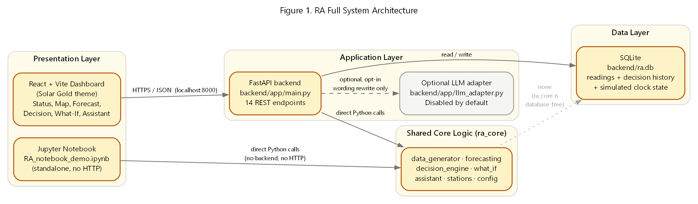
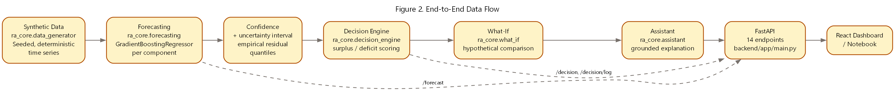
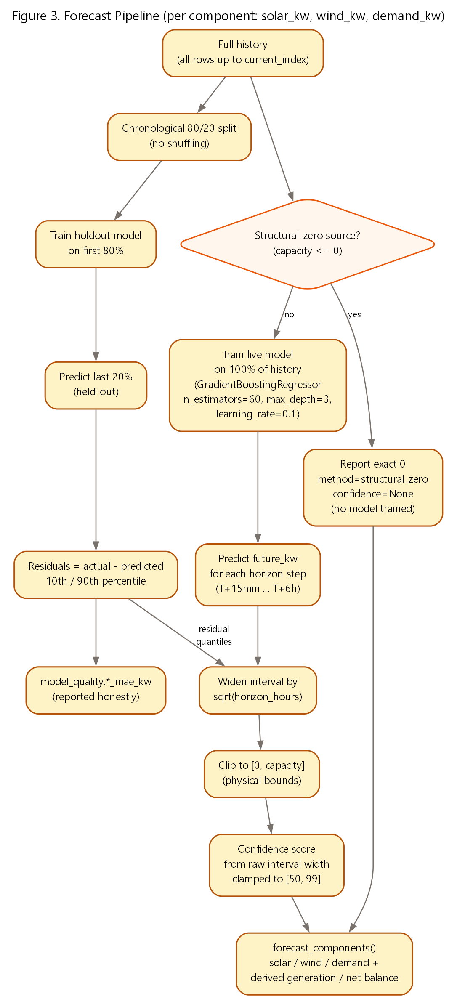
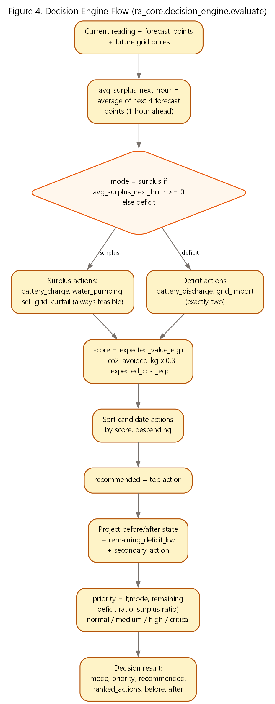
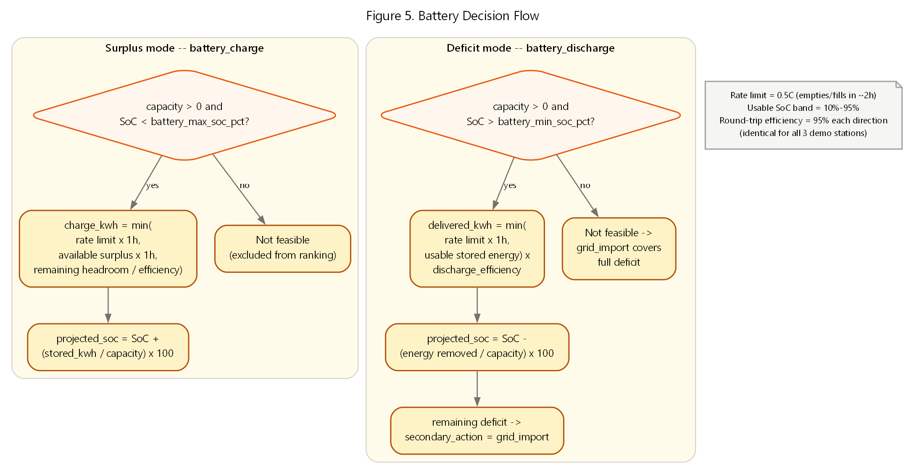
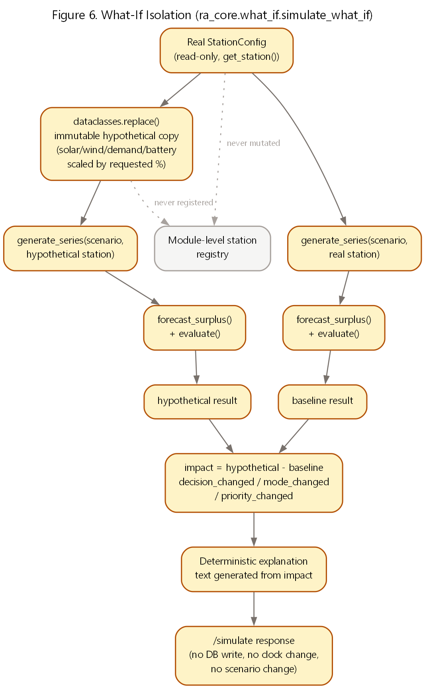
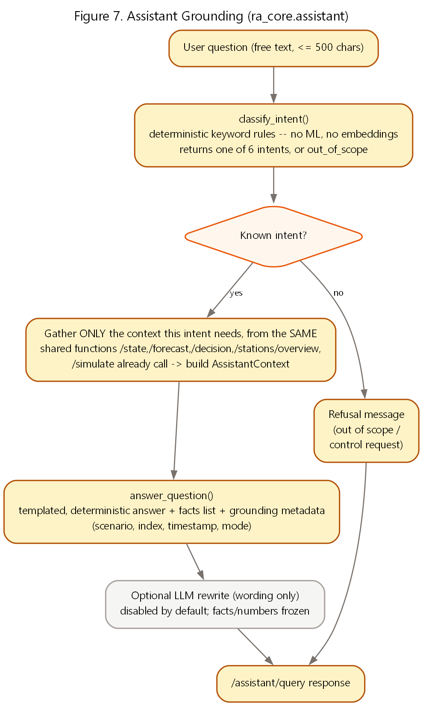
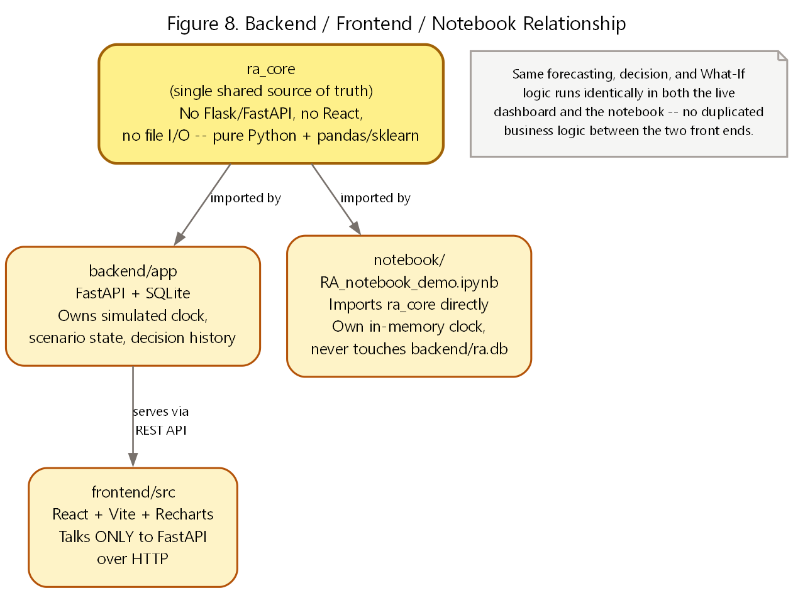
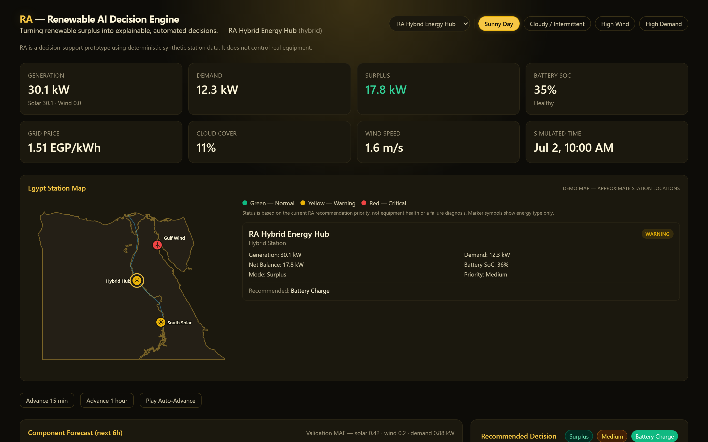
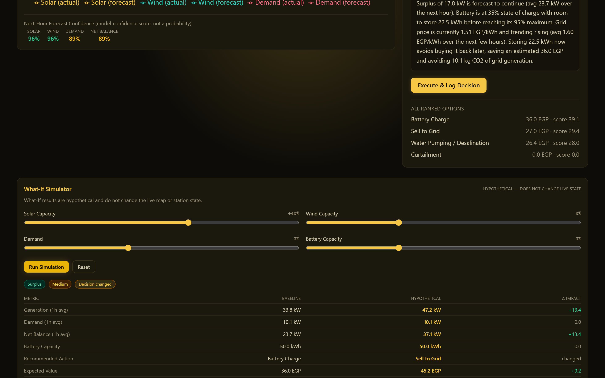

# RA — Renewable AI Decision Engine

**Final Project Documentation**

**Document version:** 1.0 | **Date:** 2026-08-02 | **Verified commit:** 090e954 | **Test suite:** 295 automated tests passing | **Status:** Working prototype — decision support, not autonomous control | **Data basis:** 100% deterministic synthetic data (disclosed throughout)

---

## Executive Summary

RA (Renewable AI Decision Engine) is a working software prototype that turns raw renewable-energy readings into an explained, actionable recommendation every 15 simulated minutes. It answers four questions an operator actually asks: what will generation and demand look like in the next few hours (Prediction), what should be done about the current surplus or deficit (Decision), why that recommendation was chosen (Explanation), and what would happen under a different assumption (Simulation).

The prototype runs against three synthetic demo stations (one solar, one wind, one hybrid) modeled on the scale and operating pattern of small Egyptian renewable sites. All station data is generated by a seeded, deterministic simulator — it is not measured data from a real facility, and this document says so explicitly everywhere it matters. What is real is the engineering: a FastAPI backend, a React dashboard, a Jupyter notebook, 295 automated tests, and a decision/forecast/explanation pipeline that runs identically across all three.

RA is decision support, not automation. It never issues a control command to real equipment; every screen and every generated explanation says so. The current build (commit 090e954) has been hardened for a live, offline demonstration: a one-click launcher, a deterministic reset script, a read-only smoke test, and verified recovery from backend-unavailable, failed-request, and rapid-input scenarios.

| Metric | Value | Source |
|---|---|---|
| Automated tests passing | 295 / 295 | pytest, this repository |
| REST API endpoints | 14 | backend/app/main.py |
| Demo stations | 3 (solar, wind, hybrid) | ra_core/stations.py |
| Weather/demand scenarios | 4 (sunny, cloudy, windy, high_demand) | ra_core/data_generator.py |
| Forecast horizon | up to 6 hours, 15-minute steps | ra_core/forecasting.py |
| Data basis | 100% synthetic, deterministic, seeded | Section 5 — Data |
| External network calls at runtime | None by default | Section 7 — Results |

*Table ES-1. Headline facts, each traceable to a specific file or test run.*

> **Business Takeaway:** RA demonstrates, end to end, what a renewable operations decision-support tool could look like: forecast, recommend, explain, and let an operator test a hypothesis before committing to it — without claiming to be a finished commercial product or citing savings that were never measured.

> **Technical Takeaway:** One shared Python core (ra_core) drives both the live FastAPI/React application and the standalone Jupyter notebook, so there is exactly one implementation of the forecasting, decision, and What-If logic to test and trust.

## 1. Problem

### 1.1 Renewable generation is variable by nature

Solar output follows the sun and collapses under cloud cover; wind output rises and falls with local wind speed on a timescale of minutes. Neither source can be commanded to produce more when demand rises, unlike a fossil-fuel plant that can be dispatched on request. A site can be generating far more than it needs at 11:00 and far less than it needs by 19:00, on the same day, with no equipment failure involved at all — just weather and the sun's position.

### 1.2 Generation and demand rarely line up

Demand has its own independent pattern — typically a morning ramp and a larger evening peak as people return home and use electricity — that does not track solar output at all, and only partially tracks wind. The result is two very different daily curves that a site operator must reconcile in real time: when they diverge one way there is a surplus to use productively before it is wasted; when they diverge the other way there is a deficit that must be covered from storage or the grid before it becomes a shortfall.

### 1.3 Battery and grid-management challenges

A battery is not an infinite buffer. It has a finite capacity, a maximum safe charge/discharge rate, a minimum state of charge it should not be driven below (to protect battery life and keep emergency reserve), and a maximum it should not be pushed above. Deciding whether to charge the battery, sell surplus to the grid, run a flexible load such as water pumping, or accept curtailment — and, in a deficit, deciding how much to discharge before falling back to grid import — requires weighing all of those constraints against the current price of grid electricity and the near-term forecast, not just the instantaneous reading.

### 1.4 Why dashboards alone are insufficient

A conventional monitoring dashboard shows current and historical values — kW, percentages, prices — and stops there. It tells an operator what happened, not what to do next or why. Two structural gaps follow from that:

- No forward view: a dashboard rarely forecasts the next few hours with an honest uncertainty range, so an operator reacts to what already occurred instead of preparing for what is about to.
- No recommendation or reasoning: a dashboard does not rank the available actions (store, sell, pump, curtail, discharge, import) by their economic and environmental value, and it does not explain, in plain language, why one action is better than the alternatives right now.

RA was built specifically to close both gaps without pretending to be more than it is: a decision-support layer on top of the same kind of data a dashboard already shows.

### 1.5 The Egyptian renewable-energy context

Egypt has committed to a substantial expansion of solar and wind capacity as part of its energy strategy, with utility-scale and distributed sites spanning very different resource profiles: strong, consistent solar in Upper Egypt and the south, strong wind along the Gulf of Suez corridor, and mixed hybrid sites elsewhere. RA's three demo stations were deliberately scaled and named to reflect that spread (a south solar site, a Gulf wind site, and a hybrid hub) — as illustrative regional placeholders for demonstration purposes, explicitly not as measured data from any named or unnamed real facility (see Section 5.1).

### 1.6 Target users and operational pain points

| User | Pain point today | What RA demonstrates |
|---|---|---|
| Site/plant operator | Reacts to surplus/deficit after it happens; no ranked action list | Live recommendation with expected value, CO2 impact, and plain-language reason |
| Renewable asset manager | Limited visibility across multiple sites at once | Multi-station map + national summary aggregation |
| Planner / analyst | Cannot easily test "what if capacity were different" without a spreadsheet exercise | What-If simulator with side-effect-free hypothetical comparison |
| Non-technical stakeholder | Raw numbers without an explanation a non-engineer can act on | Grounded assistant that answers questions in plain language |

*Table 1-1. Target users and the pain point each RA feature addresses.*

> **Business Takeaway:** The problem is not a lack of data — it is a lack of a layer that turns data into a ranked, explained recommendation an operator can act on in seconds.

> **Technical Takeaway:** RA treats forecasting, decision-making, and explanation as three distinct, testable stages rather than one opaque black box, so each stage's assumptions and limitations can be inspected independently.

## 2. Solution

RA's value proposition is four connected capabilities, each built on the same underlying data and each feeding the next: Prediction, Decision, Explanation, and Simulation.

### 2.1 Prediction

For each station, RA forecasts solar, wind, and demand independently up to six hours ahead in 15-minute steps, using a separate model per component rather than one combined "generation" number. Every forecast point carries an empirical uncertainty range (not just a point estimate) and a model-confidence score, so the dashboard never presents a guess as a certainty.

### 2.2 Decision

RA scores every feasible action for the current situation — battery charge, water pumping, sell to grid, or curtail in surplus; battery discharge or grid import in deficit — by combined economic and environmental value, ranks them, and recommends the top-scoring one. The recommendation always comes with a before/after projection and a priority level (normal, medium, high, critical) so the operator knows both what to do and how urgent it is.

### 2.3 Explanation

Every recommendation ships with a plain-language explanation that traces back to numbers already on screen: the current surplus or deficit, the battery's state of charge and headroom, the grid price and its near-term trend, and the resulting estimated value in EGP and kg of CO2 avoided or emitted. Nothing in the explanation is invented after the fact — it is generated directly from the same values used to compute the recommendation.

### 2.4 Simulation

The What-If simulator lets a user ask "what would RA recommend if solar capacity, wind capacity, demand, or battery capacity were different" and see a side-by-side comparison against the real current state — without ever touching the real station configuration, the database, or the live simulated clock. It is a hypothesis-testing tool, clearly labeled as such on screen.

### 2.5 Feature summary

- Multi-station monitoring — three independently configured demo stations sharing one global scenario and simulated clock, switchable from the dashboard.
- Forecasting with model confidence — component-level forecasts (solar/wind/demand) with empirical uncertainty intervals and a confidence score per point, not a single number.
- Surplus and deficit recommendations — a transparent, rule-scored decision engine (not a black-box model) covering both directions of imbalance.
- Battery-aware decisions — every charge/discharge amount is bounded by the station's actual rate limit, usable state-of-charge band, and round-trip efficiency.
- Grid support — deficit recommendations fall back to grid import, with its cost and emissions shown explicitly, whenever the battery cannot fully cover a shortfall.
- Egypt map — a locally rendered map (no external tiles) showing all three stations at once, with a 3-color status derived from the same priority the decision engine already computed.
- What-If simulator — hypothetical capacity/demand changes compared against the real baseline, with an explanation of what changed and why.
- Grounded assistant — a deterministic, offline question-answering layer that explains current status, forecasts, decisions, station comparisons, and What-If results using only already-computed data.

### 2.6 Why RA is more than a dashboard

| Capability | Conventional dashboard | RA |
|---|---|---|
| Forward view | Historical/current values only | Up to 6h forecast per component, with uncertainty |
| Recommendation | None — operator infers action manually | Ranked, scored actions with a top recommendation |
| Reasoning | Not shown | Plain-language explanation traced to on-screen numbers |
| Hypothesis testing | Requires a separate spreadsheet/model | Built-in, side-effect-free What-If simulator |
| Explaining results to non-experts | Requires an analyst to interpret | Grounded assistant answers directly |

*Table 2-1. RA versus a conventional monitoring dashboard.*

> **Business Takeaway:** The four capabilities are designed to compound: a better forecast makes the decision more trustworthy, a clear explanation makes the decision actionable, and simulation lets a planner de-risk a change before committing budget to it.

> **Technical Takeaway:** All four capabilities call the same underlying ra_core functions the API layer already exposes — there is no separate, duplicated calculation path for the dashboard versus the notebook versus the assistant.

## 3. Users, Use Cases, and Value Proposition

### 3.1 Primary user roles

- Site operator — needs a fast, defensible answer to "what should I do right now" for one station, backed by a reason they could repeat to a supervisor.
- Multi-site asset manager — needs to see, at a glance, which of several stations most urgently needs attention and why, without opening each station individually.
- Planner / analyst — needs to test a capacity or demand change before recommending a capital decision, and needs the comparison to be apples-to-apples (same weather, same clock, same scenario).
- Non-technical stakeholder or trainee — needs plain-language answers to questions like "why did it recommend that" without reading code or a technical manual.

### 3.2 Representative use cases demonstrated in this build

1. A hybrid station has 17.8 kW of surplus at 10:00 on a sunny day. RA recommends charging the battery, shows the projected state of charge after charging, and explains the estimated 36.0 EGP saved and 10.1 kg of CO2 avoided versus buying that energy back later.
2. The same station reaches an evening deficit. RA recommends discharging the battery first (cheaper, cleaner) and only falls back to grid import for whatever the battery cannot cover, stating the remaining shortfall explicitly.
3. An asset manager opens the Egypt map and sees, at a glance, that one station is flagged Warning while the other two are Normal — driven by the same priority the decision engine already computed, not a separate health score.
4. A planner asks "what if this station's battery were twice as large" using the What-If simulator and sees the recommendation flip from grid import to battery discharge, with the avoided cost and emissions quantified.
5. A stakeholder types "Why was this decision selected?" into the RA Assistant and receives the same explanation already on screen, in conversational form, grounded in the current station's real numbers.

### 3.3 Value proposition by audience

| Audience | What RA demonstrates today | Why it matters |
|---|---|---|
| Utilities | Multi-station recommendation + national aggregation pattern | A template for centralizing renewable dispatch decisions across sites |
| Renewable operators | Battery-aware, economically ranked action recommendations | Faster, more consistent decisions than manual judgment alone |
| Industrial sites with on-site generation | Flexible-load (water pumping) scoring alongside storage/grid options | A pattern for using surplus productively instead of curtailing it |
| Government / planning bodies | Transparent, explainable decision logic (not a black box) | Auditable reasoning suitable for policy and planning discussions |

*Table 3-1. Value proposition by audience — current demonstrated capability, not a commercial claim.*

> **Note:** All monetary and emissions figures RA reports are internally consistent estimates computed from the same synthetic price and CO2-factor assumptions described in Section 5 — they are illustrative of the *method*, not verified savings from any real deployment.

> **Business Takeaway:** The four use-case categories map directly onto four buyer personas — operator, asset manager, planner, and stakeholder/trainee — which is a useful frame for a go-to-market narrative even at prototype stage.

> **Technical Takeaway:** Every use case above was exercised against the live backend during Part 7A hardening and is reproducible with scripts/reset_demo.py and the verified demo states in Section 7.8.

## 4. AI and System Architecture

RA is built around one principle: a single shared Python core (ra_core) contains every piece of business logic — data generation, forecasting, decision-making, What-If simulation, and the assistant's grounding — and every front end (the FastAPI backend, the React dashboard, the Jupyter notebook) calls into that same core rather than re-implementing any of it.

*Figure 1. RA full system architecture — presentation, application, shared core, and data layers.*

### 4.1 ra_core — the shared core

ra_core is pure Python (pandas, numpy, scikit-learn) with no web framework, no React, and no file I/O of its own. It is organized into seven modules, each with one responsibility:

| Module | Responsibility |
|---|---|
| config.py | Shared constants: interval length, simulated history length, default battery/solar/wind sizing |
| stations.py | The fixed 3-station registry (StationConfig dataclass) and lookup helpers |
| data_generator.py | Deterministic synthetic time-series generation per scenario/station |
| forecasting.py | Component forecasts (solar/wind/demand) with intervals and confidence |
| decision_engine.py | Surplus/deficit action scoring, ranking, and priority |
| what_if.py | Side-effect-free hypothetical station comparison |
| assistant.py | Deterministic intent classification and grounded answer generation |

*Table 4-1. ra_core module responsibilities.*

### 4.2 FastAPI backend

backend/app/main.py exposes 14 REST endpoints (listed in full in Appendix A) over ra_core and a SQLite database. The backend owns three pieces of state a stateless core cannot: the simulated clock (scenario + current index), the readings table seeded once per scenario, and the decision-history log. Every read endpoint is side-effect free except the two that are explicitly a write by design: POST /tick (advances the shared clock) and POST /decision/log (records a decision).

### 4.3 React dashboard

The frontend (React 18 + Vite + Recharts, styled in the project's Solar Gold theme) talks to the backend exclusively over HTTP/JSON at localhost:8000 — it holds no independent copy of the decision or forecasting logic. Station switching, scenario switching, and tick advancement all resolve to a small number of REST calls, each guarded against race conditions from rapid clicking (see Section 9.4).

### 4.4 SQLite

A single SQLite file (backend/ra.db) stores the generated readings for the active scenario, the decision-history log, and the current simulated-clock state. It is deliberately simple — no ORM, no migrations framework — appropriate for a single-process demo backend, not a claim about production database architecture.

### 4.5 End-to-end data flow

*Figure 2. End-to-end data flow from synthetic generation through to the two front ends.*

### 4.6 Forecast pipeline

Each of solar_kw, wind_kw, and demand_kw is forecast by its own GradientBoostingRegressor (scikit-learn; n_estimators=60, max_depth=3, learning_rate=0.1, random_state=0), trained on four features already present in the synthetic data: hour-of-day (sine/cosine encoded), cloud cover, and wind speed. Total generation and net balance are always derived (solar + wind, generation − demand), never predicted directly.

*Figure 3. Forecast pipeline for one component (solar_kw, wind_kw, or demand_kw).*

Two models are trained per component and per request: a holdout model on the first 80% of history (chronological, never shuffled) validated against the last 20%, whose residuals produce both the reported MAE and the empirical 10th/90th-percentile uncertainty band; and a live model trained on 100% of history, used for the actual forward forecast. The interval widens with horizon via a transparent sqrt(hours-ahead) rule, and a station's structurally-absent source (e.g. wind on a solar-only station) is reported as an exact zero with no model trained at all, rather than a fabricated low-confidence prediction.

### 4.7 Decision-engine flow

*Figure 4. Decision engine flow (ra_core.decision_engine.evaluate).*

Mode (surplus vs. deficit) is decided from the near-term forecast average, not the instantaneous reading, so a momentary dip does not flip the recommendation. Surplus mode always scores battery charge, water pumping, sell-to-grid, and curtail (curtail is always feasible, so the action list is never empty); deficit mode scores exactly battery discharge and grid import. Every action is scored by expected economic value plus an environmental value (CO2 avoided, shadow-priced at 0.3 EGP/kg) minus any cost, then ranked.

### 4.8 Battery decision flow

*Figure 5. Battery decision flow — feasibility and sizing for charge and discharge.*

Every charge or discharge amount is bounded by three physical constraints simultaneously: the station's configured rate limit (kW), the energy actually available (surplus, or usable stored energy above the minimum SoC), and the remaining headroom to the maximum SoC — each adjusted for the station's round-trip efficiency. A station with zero configured battery capacity, or a battery already at its bound, is handled as an explicit "not feasible" case, not a crash or a silently wrong number (see Section 7.3).

### 4.9 What-If isolation

*Figure 6. What-If isolation — the real station configuration is read-only.*

simulate_what_if() reads the real station once, builds an immutable hypothetical copy via Python's dataclasses.replace(), and runs both the real and hypothetical configurations through the exact same generate_series → forecast_surplus → evaluate pipeline the live dashboard uses — never a separate or simplified calculation. Both runs share the same scenario, weather, and simulated index, so the only thing that differs between baseline and hypothetical is the change the user requested.

### 4.10 Assistant grounding

*Figure 7. Assistant grounding — deterministic intent classification and context gathering.*

The assistant never calls a language model to decide what to say. A deterministic keyword classifier picks one of six intents (or out_of_scope), the backend gathers only the context that intent needs from the same functions /state, /forecast, /decision, /stations/overview, and /simulate already use, and a template generator produces the final answer. An optional, disabled-by-default LLM pass may rephrase the wording only — it can never change a number, a fact, or the recommendation (Section 4.11).

### 4.11 Optional LLM wording adapter

backend/app/llm_adapter.py implements a single opt-in feature: if RA_ASSISTANT_LLM_ENABLED=true and a base URL, API key, and model are all configured, the deterministic answer is sent to an OpenAI-compatible chat-completions endpoint with an explicit instruction not to change any number or fact, and the rewritten text replaces only the answer field. Any failure — missing configuration, timeout, malformed response — silently falls back to the deterministic answer. This feature is off by default and was off throughout every test and demo state in this document.

### 4.12 Backend / frontend / notebook relationship

*Figure 8. Backend, frontend, and notebook all sit on top of the same ra_core.*

The Jupyter notebook (notebook/RA_notebook_demo.ipynb) imports ra_core directly and never touches the backend, its database, or the network — it maintains its own in-memory simulated clock. This means the forecasting, decision, and What-If logic exercised in the notebook is byte-for-byte the same code exercised by the live dashboard, not a re-implementation for demonstration purposes.

> **Business Takeaway:** A single shared core means one place to improve the models or the decision rules, and every surface (dashboard, notebook, future integrations) benefits immediately and consistently.

> **Technical Takeaway:** The architecture audit performed in Part 7A found no duplicated business logic, no circular imports beyond one already-documented local import, and no dead code across ra_core, the backend, and the frontend.

## 5. Data and Scenarios

### 5.1 Why deterministic synthetic data

RA uses generated, not measured, station data throughout. This is a deliberate choice, not a limitation glossed over: no real plant telemetry, SCADA feed, or metered dataset was available for this prototype, and using synthetic data lets every result in this document be exactly reproduced by anyone who runs the repository. Each scenario is generated from a seed derived from the scenario name and the station's fixed seed_offset, so the same (scenario, station) pair always produces byte-identical output — this is what makes the What-If comparisons, the reported test assertions, and the "verified demo states" in Section 7.8 exactly repeatable.

> **Note:** Every station name, coordinate, and capacity value in this document is a synthetic demo value chosen for illustrative regional variety. None of it represents a real, named, or surveyed Egyptian facility.

### 5.2 The three demo stations

| Station ID | Name | Type | Solar (kW) | Wind (kW) | Battery (kWh) | Region (illustrative) |
|---|---|---|---|---|---|---|
| solar-01 | RA South Solar Demo | Solar | 55.0 | 0.0 | 35.0 | Southern Egypt |
| wind-01 | RA Gulf Wind Demo | Wind | 0.0 | 32.0 | 35.0 | Gulf of Suez |
| hybrid-01 (default) | RA Hybrid Energy Hub | Hybrid | 40.0 | 15.0 | 50.0 | Upper Egypt |

*Table 5-1. The three registered demo stations (ra_core/stations.py).*

All three share identical battery operating assumptions: a 0.5C charge/discharge rate (empties or fills in about two hours), a 10%–95% usable state-of-charge band, and 95% round-trip efficiency in each direction. Only battery_capacity_kwh — and therefore the absolute kW rate — differs per station.

### 5.3 Scenarios

| Scenario | Cloud cover (base) | Wind speed (base, m/s) | Demand scale | Price volatility |
|---|---|---|---|---|
| sunny (default) | 0.12 | 4.5 | 1.00× | 1.0× |
| cloudy | 0.55 | 5.5 | 1.00× | 1.0× |
| windy | 0.20 | 11.0 | 1.00× | 1.0× |
| high_demand | 0.15 | 5.0 | 1.45× | 1.4× |

*Table 5-2. The four scenarios and the weather/demand parameters that distinguish them.*

### 5.4 Generated fields

- solar_kw, wind_kw — physically-shaped generation curves (solar: a bell curve centered near noon, suppressed by cloud cover; wind: proportional to wind-speed cubed), clipped to each station's capacity.
- demand_kw — a morning-plus-evening double-peak load curve, scaled by both the scenario's demand_scale and the station's own demand_scale.
- price_egp — a time-of-use price curve with an evening peak and a night discount.
- battery_soc — a physically simulated state-of-charge trace (charges on surplus, discharges on deficit, respecting the station's efficiency and capacity), clipped to a 2%–98% safety band.
- cloud_cover, wind_speed — the weather inputs the forecast models are trained on.

### 5.5 Time interval and simulated clock

Every scenario is generated at a 15-minute interval for 4 simulated days (384 points total). A shared, backend-owned simulated clock — not wall-clock time — advances one "now" pointer through that series, starting by default 136 steps in (mid-morning of day 2), chosen so a clear surplus is visible immediately on first load. Advancing the clock (Advance 15 min / Advance 1 hour / Auto-Advance) or switching scenario are the only two ways the current index changes.

### 5.6 Structural-zero handling

solar-01 has zero configured wind capacity and wind-01 has zero configured solar capacity — by design, not by accident of the random generator. The forecasting layer detects a station's structurally-absent source (capacity ≤ 0) and reports it as an exact zero with method="structural_zero" and no confidence score, rather than training a model on a column that is always zero and reporting a misleadingly confident near-zero prediction.

### 5.7 Current data limitations

- Weather (cloud cover, wind speed) is supplied to the forecaster as ground truth for the horizon being predicted, not as a noisy real-world weather forecast — real-world forecast uncertainty would be higher than what RA currently displays.
- Only 4 scenario presets exist; there is no continuous range of weather conditions between them.
- Only 3 stations are registered; the registry is a fixed Python dict, not a database table or an onboarding flow for new sites.
- No real price signal, tariff structure, or grid-connection constraint is modeled beyond the synthetic time-of-use curve.

### 5.8 How real data could replace synthetic data later

Because the forecasting, decision, and What-If functions all consume plain dict/DataFrame rows with a fixed schema (timestamp, solar_kw, wind_kw, demand_kw, price_egp, battery_soc, cloud_cover, wind_speed), replacing ra_core.data_generator with a real telemetry feed or historical dataset would not require changing the forecasting or decision logic — only the source of the rows. This is discussed as future work in Section 10, not claimed as already built.

> **Business Takeaway:** Reproducibility is a feature, not a compromise: a judge, mentor, or future engineer can regenerate every number in this document from the same seeds, with no hidden state.

> **Technical Takeaway:** The fixed row schema is the seam future integration work would target — see Section 10.1 (real SCADA/IoT integration and real plant datasets).

## 6. Forecasting, Decisions, Simulation, and the Assistant — Behavioral Detail

Section 4 described how the four capabilities are wired together. This section describes how each one actually behaves — the specific rules, ranges, and thresholds a user or evaluator would observe.

### 6.1 Reading the confidence score

RA's confidence score is a model-confidence indicator, not a probability that the forecast is correct — every screen and this document say so explicitly. It is derived from the raw (pre-physical-clipping) forecast interval width relative to a natural scale (station capacity for solar/wind, historical peak for demand), clamped to the range 50–99. Because it is computed from the raw width, confidence is guaranteed to never increase as the forecast horizon extends — a six-hour-ahead point is never reported as more confident than a fifteen-minute-ahead one for the same target.

### 6.2 Priority thresholds

Priority is a deterministic, rule-based label — no machine learning is involved in setting it:

| Mode | Condition | Priority |
|---|---|---|
| Deficit | Remaining (uncovered) deficit ≥ 30% of demand | Critical |
| Deficit | Remaining deficit > 0, below 30% of demand | High |
| Deficit | Fully covered, but only because grid import was needed | High |
| Deficit | Fully covered by the battery alone | Medium |
| Surplus | Surplus ≥ 50% of demand (large, needs decisive allocation) | Medium |
| Surplus | Below that ratio | Normal |

*Table 6-1. Priority thresholds (ra_core/decision_engine.py).*

The Egypt map's 3-color status (green/yellow/red) is a direct, fixed relabeling of this same priority value — normal→Normal, medium→Warning, high and critical→Critical — not a second, independently computed health score. It also explicitly is not equipment health, failure probability, or maintenance status; it is "how urgently does this station's current recommendation need attention."

### 6.3 What-If input ranges

| Input | Allowed range | Notes |
|---|---|---|
| solar_capacity_change_pct | -50% to +100% | Rejected (422) if requested on a station with zero configured solar capacity |
| wind_capacity_change_pct | -50% to +100% | Rejected (422) if requested on a station with zero configured wind capacity |
| demand_change_pct | -30% to +50% | Applies to the station's demand_scale |
| battery_capacity_change_pct | -50% to +100% | Scales capacity and both rate limits together, preserving the station's C-rate |

*Table 6-2. What-If input validation ranges (ra_core/what_if.py).*

Every What-If comparison reports both the raw kW/kWh deltas and, where meaningful, a percentage change — except when the baseline value is exactly zero, in which case the percentage is reported as null rather than an undefined or infinite number (verified by dedicated tests — Section 7.1).

### 6.4 Assistant intents

| Intent | Triggered by | Answered from |
|---|---|---|
| explain_current_status | "what is happening now", "current status", etc. | Current reading + decision |
| explain_forecast | "forecast", "next six hours", "upcoming hours", etc. | Component forecast |
| explain_decision | "recommend", "decision", "why was this", an action name, etc. | Full decision result |
| compare_stations | "compare", "which station", "needs attention", etc. | 3-station overview |
| explain_what_if | "what if", "simulate", "hypothetical", etc. | Most recent What-If result (if any) |
| help | "help", "what can you do", etc. | A fixed list of example questions |
| out_of_scope | Anything else, or an imperative control phrase ("discharge the battery now") | A refusal message — RA never accepts a control command |

*Table 6-3. The assistant's 6 intents plus the explicit out-of-scope / refusal path.*

The classifier is intentionally narrow on the word "why" — a bare "why" is not enough to trigger explain_decision (it would over-match unrelated questions like "why is the sky blue"); decision intent requires a domain-specific word such as an action name, "recommend", "decision", or "selected".

### 6.5 What each screen shows, at a glance

- Status panel — generation, demand, surplus/deficit, battery SoC, grid price, cloud cover, wind speed, simulated time, for the selected station.
- Egypt map — all 3 stations at once, colored by priority-derived status, with a detail card for the selected station.
- Component forecast chart — solar/wind/demand actual + forecast lines, a "now" marker, and next-hour confidence for each component plus net balance.
- Recommended decision card — the top action, its projected before/after state, the full ranked list of alternatives, and an Execute & Log Decision button.
- What-If simulator — four sliders, a baseline-vs-hypothetical comparison table and chart, and a generated explanation of the impact.
- RA Assistant — a free-text question box, five quick-question shortcuts, and a grounded answer with supporting fact chips.
- Decision log — the history of logged decisions for the selected station, isolated per station.

> **Business Takeaway:** Every number an operator sees traces back to one of these seven screens and, ultimately, to a single computed value — there is no separate "marketing dashboard" number that could drift from the underlying calculation.

> **Technical Takeaway:** Confidence, priority, and status are all deliberately simple, auditable rules rather than learned scores — a design choice that trades some predictive sophistication for full explainability.

## 7. Results and Validation

Every figure in this section was captured directly from the repository at commit 090e954 — either from a pytest run, a live API call against the running backend, or a rendered screenshot of the dashboard. None is estimated or rounded for effect.

### 7.1 Test suite

| Test file | Tests | Covers |
|---|---|---|
| test_api.py | 100 | All 14 REST endpoints, validation, error handling, side effects |
| test_assistant.py | 48 | Intent classification, grounded answers, refusals |
| test_what_if.py | 27 | What-If validation, isolation, determinism, edge cases |
| test_decision_deficit.py | 33 | Deficit-mode battery/grid logic, priority thresholds |
| test_forecast_components.py | 22 | Forecast shape, intervals, confidence, structural zero |
| test_stations.py | 14 | Station registry integrity and battery constraints |
| test_data_generator.py | 14 | Determinism, scenario variety, capacity bounds |
| test_decision_engine.py | 15 | Surplus-mode action ranking and feasibility |
| test_llm_adapter.py | 7 | LLM adapter disabled-by-default and failure fallback |
| test_database_migration.py | 8 | SQLite schema migration integrity |
| test_forecasting.py | 5 | Backward-compatible forecast_surplus() contract |
| test_notebook_compat.py | 2 | Notebook/backend contract compatibility |
| Total | 295 | All passing at commit 090e954 |

*Table 7-1. Test suite composition (295 tests, 0 failing).*

### 7.2 Forecast validation metrics

Mean absolute error (MAE) is computed honestly, out-of-sample, from the chronological 80/20 holdout described in Section 4.6 — not from data the live model was trained on. Measured live, at the default starting point (sunny scenario, index 136) for all three stations:

| Station | Solar MAE (kW) | Wind MAE (kW) | Demand MAE (kW) | Generation MAE (kW) | Net balance MAE (kW) |
|---|---|---|---|---|---|
| solar-01 | 0.62 | — (structural zero) | 0.50 | 0.62 | 0.76 |
| wind-01 | — (structural zero) | 0.19 | 0.96 | 0.19 | 0.98 |
| hybrid-01 | 0.42 | 0.20 | 0.88 | 0.43 | 0.91 |

*Table 7-2. Live forecast validation MAE per station (chronological_holdout method).*

Interval method is empirical_residual_quantiles with an 80% nominal coverage (10th–90th percentile of holdout residuals), widened by a sqrt(hours-ahead) factor. Confidence is clamped to [50, 99] and is guaranteed monotonically non-increasing with horizon by construction (verified by dedicated tests in test_forecast_components.py).

### 7.3 Decision and battery-constraint verification

The decision engine's feasibility rules are exercised directly by 48 tests across test_decision_engine.py and test_decision_deficit.py, including boundary cases added during Part 7A hardening: zero battery capacity in both surplus and deficit modes, SoC exactly at the minimum/maximum bound, zero demand, zero generation, and an empty forecast list (dataset-end). All pass without raising an exception or returning a non-finite value.

| Verified property | How |
|---|---|
| Charge/discharge amount never exceeds the rate limit | test_charge_amount_does_not_exceed_rate_limit, test_discharge_amount_does_not_exceed_rate_limit |
| Projected SoC never exceeds max / drops below min | test_projected_soc_does_not_exceed_max_soc, test_discharge_does_not_reduce_soc_below_minimum |
| Zero battery capacity excludes the battery action, not a crash | test_zero_capacity_battery_makes_discharge_infeasible, test_zero_battery_capacity_excludes_charge_in_surplus_mode |
| Deficit always has a feasible fallback (grid import) | test_deficit_with_unavailable_battery_recommends_grid_import |
| A zero-capacity station cannot crash the data generator | test_zero_battery_capacity_does_not_crash (regression test for a fix made in Part 7A) |

*Table 7-3. A sample of battery/decision safety properties and the tests that verify them.*

### 7.4 Side-effect-free What-If verification

test_simulate_has_no_side_effects_on_state_history_or_overview and test_no_database_or_global_state_dependency assert byte-for-byte that repeated /simulate calls never change /state, /history, /stations/overview, or /national/summary. test_registry_and_station_objects_are_completely_untouched asserts the real station registry is never mutated. This was re-confirmed live during Part 7A: 3 repeated /simulate calls left the decision history exactly unchanged.

### 7.5 Assistant grounding verification

48 tests in test_assistant.py cover all 6 intents, the out-of-scope/refusal path, and the "grounding" metadata (scenario, index, timestamp, station, whether a What-If result was included) attached to every answer. The optional LLM rewrite path is covered by 7 additional tests confirming it is disabled by default and falls back safely on any failure.

### 7.6 Latency (measured locally)

| Endpoint | Min | Avg | Max |
|---|---|---|---|
| GET /forecast?hours=6 | 118 ms | 127 ms | 149 ms |
| GET /decision | 128 ms | 132 ms | 137 ms |
| GET /stations/overview | 277 ms | 293 ms | 314 ms |
| GET /national/summary | 10 ms | 16 ms | 21 ms |
| POST /simulate | 242 ms | 247 ms | 256 ms |
| POST /assistant/query | 121 ms | 129 ms | 137 ms |

*Table 7-4. Endpoint latency, 5 samples each, local machine, warm backend — not a production benchmark, but representative of interactive responsiveness during the demo.*

### 7.7 Offline operation

A repository-wide search for outbound URLs found none pointing anywhere but localhost, except printed setup instructions and test-only mock URLs used with monkeypatching. The optional LLM rewrite path is off by default (RA_ASSISTANT_LLM_ENABLED unset) and was off throughout every test, timing, and screenshot in this document. The Egypt map's boundary data is bundled into the frontend at build time via a static import — it is never fetched at runtime.

### 7.8 Final demo scenarios (verified live)

| Scenario | Station / preset / index | Mode | Recommendation |
|---|---|---|---|
| Clear surplus | hybrid-01, sunny, index 136 (start) | Surplus | Battery Charge |
| Deficit, battery covers it | hybrid-01, sunny, index 170 (+34 ticks) | Deficit | Battery Discharge (remaining deficit 0) |
| Deficit, needs grid | hybrid-01, sunny, index 180 (+44 ticks) | Deficit | Grid Import (battery at 2%, its minimum) |
| What-If flips the decision | Same as above + battery capacity +100% | Deficit | Grid Import → Battery Discharge |

*Table 7-5. Reproducible demo states (see also Table ES-1).*

*Figure 9. The live dashboard at the default demo state — identity, disclosure, station state, and the Egypt map.*

*Figure 10. What-If simulator: a +40% solar-capacity hypothesis flips the recommendation from Battery Charge to Sell to Grid.*

> **Business Takeaway:** 295 automated tests and a live, reproducible demo state are the strongest evidence a prototype at this stage can offer — stronger than a claimed accuracy percentage with no measurement behind it.

> **Technical Takeaway:** All MAE, latency, and test-count figures in this section can be regenerated by any evaluator by running pytest and scripts/smoke_test.py against a freshly reset backend.

## 8. Business and Environmental Impact

This section separates what RA has demonstrated in this build from what the approach could plausibly deliver in a real deployment. The two are kept deliberately apart — the current prototype has not been deployed against a real site, so no financial savings or emissions reduction has actually been measured.

### 8.1 Currently demonstrated impact

- Decision speed — a ranked, explained recommendation is produced in well under a second (Table 7-4), versus a manual judgment call that requires an operator to mentally weigh price, forecast, and battery state.
- Consistency — the same rules are applied every time, for every station, removing operator-to-operator variance in how a surplus or deficit is handled.
- Transparency — every recommendation is accompanied by its expected value in EGP, its CO2 impact in kg, and a plain-language reason, all traceable to the same numbers shown elsewhere on screen.
- Hypothesis testing without risk — the What-If simulator lets a planner see the effect of a capacity or demand change before committing to it, with zero effect on the real station or its logged history.

### 8.2 Potential future impact (not yet measured)

| Dimension | Potential value (future, if deployed on real data) |
|---|---|
| Operational | Faster, more consistent surplus/deficit response than manual monitoring alone |
| Economic | Better-timed battery use and grid export/import decisions could reduce cost — the actual EGP figure depends entirely on real tariffs and real generation, neither of which this prototype has measured |
| Environmental | Less curtailed renewable energy and more battery-first (versus grid-first) deficit coverage could reduce reliance on grid generation — the actual CO2 figure depends on the real grid emissions factor and real dispatch behavior |
| Trust / adoption | Explainable recommendations (versus an opaque model) may increase operator willingness to follow automated guidance |

*Table 8-1. Potential future impact — explicitly not yet demonstrated or measured.*

### 8.3 Reduced renewable curtailment (mechanism, not a measured outcome)

RA's surplus-mode ranking always considers water pumping (a flexible load) and battery storage before curtailment, and only recommends curtailment when storage, flexible load, and grid export are all infeasible or uneconomical. This is a mechanism that, if applied to a real site with real curtailment losses, would tend to reduce them — the prototype has not measured an actual curtailment reduction because it has no real curtailment baseline to compare against.

### 8.4 Better battery use and reduced grid dependency (mechanism, not a measured outcome)

In deficit mode, RA always prefers battery discharge over grid import when the battery can deliver the energy within its rate limit and minimum-SoC bound, falling back to grid import only for whatever remains. This ordering is enforced by the scoring function, not a hard-coded preference, so it holds even as prices or CO2 factors change (see the deficit demo state in Table 7-5, where the battery covers the full deficit and grid import is not needed).

### 8.5 Value by sector (potential, not current deployment)

| Sector | Potential value |
|---|---|
| Utilities | A template for centralizing multi-site renewable dispatch decisions with a consistent, auditable rule set |
| Renewable operators | Faster surplus/deficit response and a documented reason for every action, useful for operational review |
| Industrial sites with on-site generation | A pattern for directing surplus to flexible loads instead of defaulting to curtailment or grid export |
| Government / planning bodies | An explainable, non-black-box reference implementation suitable for policy and planning discussions about automated dispatch |

*Table 8-2. Potential value by sector — extrapolated from the demonstrated mechanism, not from a pilot deployment.*

> **Business Takeaway:** The honest framing here — mechanism demonstrated, outcome not yet measured — is intentional: it is the difference between a credible prototype pitch and an overclaimed one.

> **Technical Takeaway:** Any future pilot would need to log real dispatch decisions against a real baseline (e.g. "what would have happened without RA") before any savings or emissions number could be reported honestly.

## 9. Limitations and Risks

### 9.1 Data limitations

- All station data is synthetic and deterministic — no real telemetry has been ingested or validated against.
- Weather inputs are supplied to the forecaster as ground truth for the horizon being predicted, which makes today's confidence scores optimistic relative to a real weather-forecast-driven system.
- Only 3 stations and 4 scenario presets exist; there is no continuous parameter space or onboarding flow for new sites.

### 9.2 Modeling limitations

- The GradientBoostingRegressor models use a small, fixed feature set (hour-of-day, cloud cover, wind speed) — no temperature, humidity, panel soiling, or turbine-specific effects are modeled.
- The decision engine is a transparent scoring rule, not a learned optimizer — it will not discover a non-obvious strategy a rule-based system was not designed to consider.
- The battery model has no degradation, cycle-counting, temperature effect, or state-of-health estimation, and assumes exactly one battery per station.

### 9.3 Scope limitations

- RA is decision support only. It never sends a control command to real equipment, and the assistant explicitly refuses imperative control phrasing ("discharge the battery now") rather than acting on it.
- There is no user authentication, authorization, or audit trail beyond the decision-history log — unsuitable, as-is, for a multi-user production deployment.
- The national summary is a simple aggregation across the 3 registered stations — it does not perform any cross-station optimization or energy transfer.

### 9.4 Engineering risks and how they were mitigated in this build

| Risk | Mitigation in this build |
|---|---|
| Backend unavailable during a demo | Frontend shows a clear error banner instead of a blank/frozen screen |
| Rapid clicking causing duplicate or out-of-order requests | Request-ID and busy-state guards added in Part 7A, verified live |
| A crash from an unexpected numeric edge case (zero battery, zero demand, dataset end, etc.) | 10 focused regression tests added in Part 7A; 295/295 passing |
| Non-deterministic demo results | All data generation is seeded; scripts/reset_demo.py returns to a known state |
| Silent LLM dependency at demo time | LLM rewrite is off by default and every test/timing/screenshot in this document was captured with it off |

*Table 9-1. Key engineering risks identified and mitigated during Part 7A hardening.*

### 9.5 Known, disclosed, unresolved items

- The /national/summary endpoint exists and is tested, but the dashboard has no UI screen for it yet — adding one was judged out of scope for the reliability-hardening pass that most recently touched this codebase.
- A frontend dependency (esbuild, via Vite's dev server) carries a known, low-real-world-risk advisory for local, non-public dev servers; fixing it requires a breaking Vite upgrade not attempted in this build.

> **Business Takeaway:** Naming these limitations here, rather than leaving them for a mentor or judge to discover, is itself part of demonstrating engineering maturity.

> **Technical Takeaway:** Every mitigation in Table 9-1 is backed by a specific test or a live-verified behavior described earlier in this document — none is asserted without evidence.

## 10. Future Work

Every item below is a planned or plausible next step. None of it is implemented in the current build — it is listed here to distinguish clearly between what RA does today and what it could grow into.

### 10.1 Data and integration

- Real SCADA and IoT integration — replace the synthetic data generator with a live telemetry feed, using the same fixed row schema the forecasting and decision functions already consume.
- Real weather forecasts — replace the ground-truth-weather assumption with an actual weather-forecast API, which would also make the reported confidence scores more realistic.
- Real plant datasets — validate the forecasting models against historical data from an actual site before relying on them operationally.
- Additional stations — extend the fixed 3-station registry into a proper onboarding flow for new sites.

### 10.2 Modeling and optimization

- National-scale optimization — move beyond simple aggregation (Section 9.3, /national/summary) toward genuine cross-station coordination or energy transfer.
- Advanced storage models — degradation, cycle-counting, temperature effects, state-of-health estimation, and multi-battery sites.
- Anomaly detection — flag equipment behavior that looks abnormal, distinct from the current priority system (which reflects recommendation urgency, not equipment health).
- Predictive maintenance — forecast component wear or failure risk, which RA explicitly does not do today.
- Cleaning optimization — for solar assets, recommend panel-cleaning schedules based on soiling-driven output loss (not modeled in the current synthetic generator).

### 10.3 Platform and operations

- User authentication and roles — needed before any multi-user or production deployment.
- Cloud deployment — move from a local single-process demo to a managed, scalable hosting environment.
- Model monitoring — track forecast accuracy drift over time against real outcomes, something a synthetic-data prototype cannot exercise.
- Cybersecurity — a real deployment would need authentication, transport security beyond a permissive local CORS policy, input hardening for any externally-facing endpoint, and a security review.
- Human approval workflows — an explicit "approve before executing" step for any future integration that could affect real equipment, consistent with RA's current decision-support-only positioning.

> **Business Takeaway:** The roadmap above follows a natural sequence: prove the decision logic on synthetic data first (this build), validate it against real data second, then integrate and scale.

> **Technical Takeaway:** Because ra_core has no dependency on the synthetic generator's internals beyond a fixed row schema, most of Section 10.1 is an integration effort, not a rewrite of the forecasting or decision logic.

## 11. Conclusion

RA demonstrates a complete, working decision-support loop — Prediction, Decision, Explanation, Simulation — running consistently across a FastAPI backend, a React dashboard, and a Jupyter notebook, all sharing one Python core. The prototype is built on deterministic synthetic data, disclosed as such throughout, and is positioned honestly as decision support rather than autonomous control: it explains what it would recommend and why, and it never issues a command to real equipment.

295 automated tests, a verified offline-only runtime, a one-click launcher, a deterministic reset script, and a set of reproducible demo states give this build a level of operational readiness beyond a typical hackathon prototype, while the Limitations section (9) and Future Work section (10) are equally explicit about what has not yet been built or measured. Together, they are intended to give a judge, mentor, or future engineer an accurate picture of exactly where this project stands today.

## 12. Business and Technical Presentation References

This section summarizes the two suggested presentation storylines. The full slide-by-slide mapping — each slide's purpose and the exact evidence (table, figure, or number) from this document to use on it — is in the companion file docs/PRESENTATION_REFERENCE.md.

### 12.1 Business presentation storyline (8–12 slides)

1. Problem — renewable variability and the generation/demand mismatch (Section 1).
2. Market need — target users and pain points (Section 3).
3. Solution — Prediction + Decision + Explanation + Simulation (Section 2).
4. Value proposition — why RA is more than a dashboard (Table 2-1).
5. Demo — the verified surplus and deficit demo states (Table 7-5).
6. Demo — the What-If simulator flipping a recommendation (Figure 10).
7. Impact — current demonstrated impact versus potential future impact (Section 8).
8. Scalability — from 3 demo stations to a real, multi-site deployment (Section 10).
9. Future vision — the roadmap (Section 10) and what "decision support, not automation" means for trust and adoption.

### 12.2 Technical presentation storyline (10–15 slides)

1. Architecture — the four-layer system and the shared ra_core (Figure 1).
2. Data — synthetic, deterministic, disclosed (Section 5).
3. Models — per-component GradientBoostingRegressor forecasting (Figure 3).
4. Validation — chronological holdout and honest MAE (Table 7-2).
5. Confidence — what the score does and does not mean (Section 6.1).
6. Decisions — the scoring and ranking rule (Figure 4).
7. Battery constraints — rate limits, SoC bounds, efficiency (Figure 5).
8. What-If — isolation guarantees (Figure 6).
9. Assistant grounding — deterministic intents, no free-form LLM decision-making (Figure 7).
10. APIs — the 14-endpoint surface (Appendix A).
11. Tests — 295 passing, what they cover (Table 7-1).
12. Reliability — race-condition guards and numerical-safety hardening (Section 9.4).
13. Limitations — data, modeling, and scope (Section 9).

> **Note:** The two storylines intentionally reuse the same underlying evidence — they differ in framing and depth, not in the facts presented, so a business and a technical audience never receive conflicting numbers.

## Appendix A. REST API Reference

| Method | Path | Purpose |
|---|---|---|
| GET | /health | Liveness check |
| GET | /scenarios | List the 4 scenario presets |
| GET | /stations | List the 3 registered stations |
| GET | /stations/overview | Current snapshot for all 3 stations (map data) |
| POST | /scenario | Switch the shared scenario and reset the simulated clock |
| POST | /tick | Advance the shared simulated clock |
| GET | /state | Current reading for one station |
| GET | /forecast | Component forecast (solar/wind/demand) for one station |
| GET | /decision | Current recommendation for one station |
| POST | /decision/log | Log the current recommendation to history |
| GET | /history | Decision-log history for one station |
| GET | /national/summary | Aggregated totals across all 3 stations |
| POST | /simulate | Side-effect-free What-If comparison |
| POST | /assistant/query | Grounded natural-language question answering |

*Table A-1. All 14 REST endpoints (backend/app/main.py).*

## Appendix B. Glossary

| Term | Meaning in RA |
|---|---|
| Surplus / Deficit | generation − demand ≥ 0 or < 0, decided from the near-term forecast average |
| Priority | A deterministic urgency label (normal/medium/high/critical), not equipment health |
| Status (map) | A direct 3-color relabeling of priority, for the Egypt map only |
| Confidence score | A model-confidence indicator in [50, 99]; not a probability of correctness |
| What-If | A read-only hypothetical comparison; never changes real station state |
| Grounded answer | An assistant answer generated only from already-computed data, never invented |
| Structural zero | A station's physically-absent energy source (e.g. wind on a solar-only site), reported as an exact 0 with no model trained |

*Table B-1. Key terms used throughout this document.*

## Appendix C. Document Control

| Field | Value |
|---|---|
| Verified commit | 090e954 ("Part 7A: finalize integration and demo reliability") |
| Test count at time of writing | 295 / 295 passing |
| Prepared for | Business presentation, technical presentation, judges/mentors, future development |
| Companion file | docs/PRESENTATION_REFERENCE.md |
| Source of truth | docs/RA_Final_Project_Documentation.md (this content, in Markdown) |

*Table C-1. Document control.*
